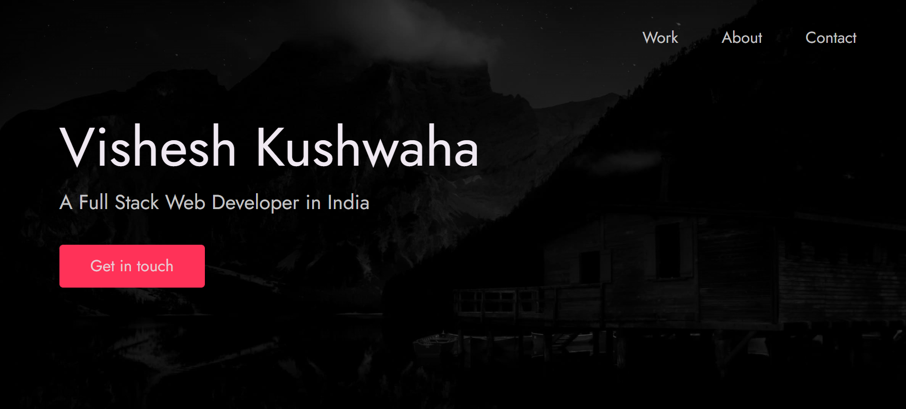

# Portfolio Template

### A beautiful minimal and accessible portfolio template for Developers ✨.

## Features

- Clean, Simple and Modern UI Design.
- Uses No CSS or JavaScript Frameworks or libraries as dependencies.
- Built with only HTML, CSS and a bit of JavaScript 🔨.
- Well Organized Documentation.
- Keyboard support.
- Fully Responsive.
- Loads fast ⚡.

## Lighthouse Report

### Contributions are warmly welcomed ❤️.

## Getting Started 🚀

```
```
## Editing the Template 🔨

Go to `index.html` and fill your information. 

### Header

In all of the places where you're supposed to fill your information you'll find HTML comments. As shown below just replace what is already in the opening and closing tags below the comment with your information.

```html
<!-- 
  Hello 😊.

  This template is designed and developed by Nisar Hassan Naqvi
  for anyone to use for free or customize the way they like.

  Github Repo: https://github.com/nisarhassan12/portfolio-template/
  My Website: https://nisar.dev

  For business & inquires, contact me => syednisarhassan12@gmail.com
-->

<!--
  Follow the instructions written in comments to create your stunning portfolio
-->

<!DOCTYPE html>
<html lang="en">
  <!DOCTYPE html>
<html>
<head>
<meta name="viewport" content="width=device-width, initial-scale=1">


<head>
  <meta charset="UTF-8" />
  <meta name="viewport" content="width=device-width, initial-scale=1.0" />
  <link rel="shortcut icon" type="image/png" href="./images//VLogo.png" />

  <!-- Put your site title here -->
  <title>
    Vishesh Kushwaha | A Full Stack Web Developer.
  </title>

  <meta name="description" content="Add small description of yourslef.">
  <!-- Add some coding keywords below, Ex: (React, CSS etc) -->
  <meta name="keywords" content="Put your name, skills and some coding keywords" />
  <link rel="stylesheet" href="index.css" />
</head>

<body>

  <!-- ***** Header ***** -->

  <header class="header" role="banner" id="top">
    <div class="row">
      <nav class="nav" role="navigation">
        <ul class="nav__items">
          <li class="nav__item"><a href="#work" class="nav__link">Work</a></li>
          <!-- <li class="nav__item"><a href="#clients" class="nav__link">Clients</a></li> -->
          <li class="nav__item">
            <a href="#about" class="nav__link">About</a>
          </li>
          <li class="nav__item">
            <a href="#contact" class="nav__link">Contact</a>
          </li>
        </ul>
      </nav>
    </div>
    <div class="header__text-box row">
      <div class="header__text">
        <h1 class="heading-primary">
          <!-- Replace the following name with your name -->
          <span class="nv1">Vishesh Kushwaha</span>
        </h1>
        <!-- Put a small paragraph about yourself -->
        <p class="nv1">A Full Stack Web Developer in India</p>
        <a href="#contact" class="btn btn--pink">Get in touch  ⮞</a>
      </div>
    </div>
  </header>

  <main role="main">

    <!-- ***** Work ***** -->

    <section class="work" id="work">
      <div class="row">
        <h2>My Work</h2>
        <div class="work__boxes">

          <!-- Each div with the work__box class is a project. -->

          <div class="work__box">
            <div class="work__text">
              <h3>Portfolio Template</h3>
              <p class="p31">
                Complete Portfolio use by
              </p>
              <ul class="work__list">
                <li>HTML</li>
                <li>CSS</li>
                <li>JavaScript</li>
              </ul>

              <div class="work__links">
                <a href="https://nisar.surge.sh" target="_blank" class="link__text">
                  Visit Site <span>&rarr;</span>
                </a>
                <a href="https://github.com/nisarhassan12/portfolio" title="View Source Code" target="_blank">
                  
                </a>
              </div>
            </div>
            <div class="work__image-box">
              
            </div>
          </div>

          <div class="work__box">
            <div class="work__text">
              <h3>Calculator</h3>
              <p>
                Lorem ipsum dolor sit amet consectetur adipisicing elit. Quod,
                eius.
              </p>
              <ul class="work__list">
                <li>HTML</li>
                <li>CSS</li>
                <li>Node</li>
                <li>MongoDB</li>
              </ul>

              <div class="work__links">
                <a href="https://apple-tvclone.netlify.app/" class="link__text">
                  Visit Site <span>&rarr;</span>
                </a>
                <a href="https://github.com/codewithritik/tvapple-Clone">
                  
                </a>
              </div>
            </div>
            <div class="work__image-box">
              
            </div>
          </div>

          <div class="work__box">
            <div class="work__text">
              <h3>Notificator</h3>
              <p>
                Lorem ipsum dolor sit amet consectetur adipisicing elit. Quod,
                eius.
              </p>
              <ul class="work__list">
                <li>React</li>
                <li>Next.js</li>
                <li>Node</li>
                <li>MongoDB</li>
              </ul>

              <div class="work__links">
                <a href="#" class="link__text">
                  Visit Site <span>&rarr;</span>
                </a>
                <a href="#">
                  
                </a>
              </div>
            </div>
            <div class="work__image-box">
              
            </div>
          </div>
        </div>
      </div>
    </section>

    <!-- ***** Clients ***** -->
<!-- 
    <section class="client" id="clients">
      <div class="row">
        <h2>Clients</h2>
        <div class="client__logos"> -->
          <!-- Add logos of the clients or companies you'have worked with. -->
          <!-- 
          
          
          
          
          
        </div>
      </div>
    </section> -->

    <!-- ***** About ***** -->

    <section class="about" id="about">
      <div class="row">
        <h2>About Me</h2>
        <div class="about__content">
          <div class="about__text">
            <!-- Replace the below paragraph with info about yourself -->
            <p>
             <span style="color: crimson; font-weight: bold; font-size: 20px;">Hii</span> I'm Vishesh Kushwaha here,
             I was completed many Project kind of Ecomerce and Social Media use by HTML | JavaScript | CSS | NodeJs | ExpressJs etc. So I know well JavaScrip.
             I like Upgrat my skill and learn somthing new from Projects. 


            </p>
            <!-- Provide a link to your resume -->
            <a href="https://docs.google.com/document/d/1ZKR99nojXsHpzuY0nOoTQJ1_YmR61PeQmKFmWpZWpuQ/edit?usp=sharing" class="btn1">My Resume</a>
          </div>

          <div class="about__photo-container">
            <!-- Add a nice photo of yourself -->
            
          </div>
        </div>
      </div>
    </section>
  </main>

  <!-- ***** Contact ***** -->

  <section class="contact" id="contact">
    <div class="row">
      <h2>Get in Touch</h2>
      <div class="contact__info">
        <p>
          Are you looking for a <span style="color: crimson;font-weight: 700;">fast-performing</span> and user-friendly website to
          represent your product or business? or looking for any kind of
          consultation? or want to ask questions? or have some advice for me
          or just want to say "Hi 👋" in any case feel free to Let me know. I
          will do my best to respond back. 😊 The quickest way to reach out to
          me is via an <span style="color: crimson; font-weight: 700;">email</span> .
        </p>
        <!-- Replace the email with yours -->
        <a href="mailto:kvish318@gmail.com" class="btn1">@Email</a>
      </div>
    </div>
  </section>

  <!-- ***** Footer ***** -->

  <footer role="contentinfo" class="footer">
    <div class="row">
      <!-- Update the links to point to your accounts -->
      <ul class="footer__social-links">
        <li class="footer__social-link-item">
          <a href="https://twitter.com/KuahwahaVishesh" title="Link to Twitter Profile">
            
          </a>
        </li>
        <li class="footer__social-link-item">
          <a href="https://github.com/vishesh11111" title="Link to Github Profile">
            
          </a>
        </li>
        <li class="footer__social-link-item">
          <a href="https://codepen.io/vishesh11111" title="Link to Codepen Profile">
            
          </a>
        </li>
        <li class="footer__social-link-item">
          <a href="https://www.linkedin.com/in/visheshkushwaha/">
            
          </a>
        </li>
      </ul>

      <!-- If you give me some credit by keeping the below paragraph, will be huge for me 😊 Thanks. -->
      <p>
        &copy; 2022 - Template designed & developed by <a href="https://nisar.dev" class="link">Vishesh</a>.
      </p>
      <div class="footer__github-buttons">
        <!-- <iframe
          src="https://ghbtns.com/github-btn.html?user=nisarhassan12&repo=portfolio-template&type=watch&count=true"
          frameborder="0" scrolling="0" width="170" height="20" title="Watch Portfolio Template on GitHub">
        </iframe> -->
      </div>
    </div>
  </footer>

  <a href="#top" class="back-to-top" title="Back to Top">
    
  </a>
  <script src="./index.js"></script>
</body>

</html>
